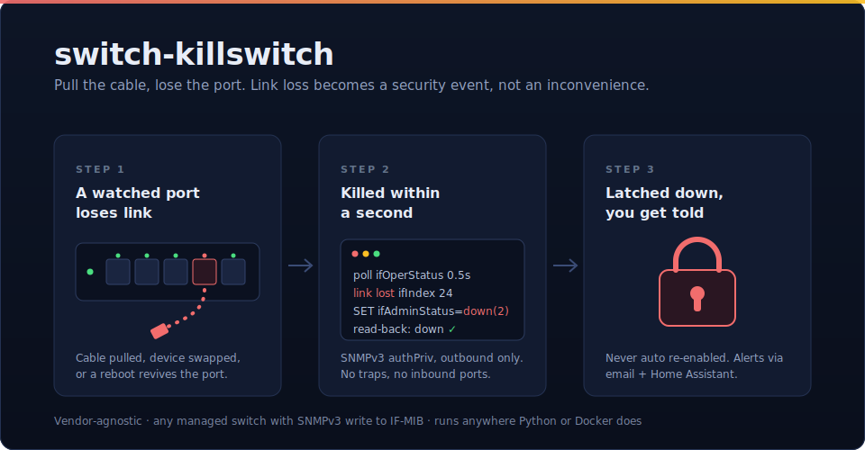

<p align="center">
  
</p>

# switch-killswitch

**If someone unplugs a cable from a watched switch port, that port gets shut
off — and stays off until a human turns it back on.**

Think of the network drop in a lobby, a door controller, a camera on a pole,
or that one port in a meeting room: places where an unplugged cable should be
treated as a security event, not an inconvenience. When a watched port loses
link, switch-killswitch administratively shuts it (`ifAdminStatus = down(2)`),
so plugging *anything* back in does nothing until an admin manually
re-enables the port.

It's vendor-agnostic: it works against any managed switch that supports
SNMPv3 with write access to the standard IF-MIB. It's tested on Ubiquiti
EdgeSwitch / Broadcom FASTPATH — extra field notes for that family live in
[`docs/fastpath-notes.md`](docs/fastpath-notes.md).

## How it works

1. **Detect.** The service polls `ifOperStatus` + `ifLastChange` for the
   allowlisted ports (default every 0.5 s) over SNMPv3 authPriv. Polling was
   chosen over traps deliberately: no inbound ports, no reliance on the
   switch's trap engine (which some firmware ships broken), and the
   `ifLastChange` comparison catches drops that recover between two polls —
   a fast device swap can't slip through unseen. A switch reboot also moves
   `ifLastChange`, so a power-cycle that would revive an unsaved admin-down
   gets re-killed.

2. **Kill.** An SNMPv3 SET of `ifAdminStatus.<ifIndex> = down(2)`, then a
   read-back to verify it actually took. Actions are debounced per port and
   rate-limited globally, so a misbehaving switch can't trigger a storm.

3. **Stay killed.** The service never re-enables a port *on its own* —
   bringing one back is always a deliberate human action, whether on the
   switch or via the optional [Home Assistant toggle](#see-and-re-enable-ports-from-home-assistant).
   A port that is already down when the service starts is treated as baseline
   and never retro-killed.

### The arming delay (why a re-enabled port isn't instantly re-killed)

Links commonly bounce once shortly after an admin re-enables a port — autoneg
restarts, PoE devices reinitialise. So a port must be continuously up for
`ARM_DELAY` (default 30 s) before it's on the instant trigger. While the port
is still settling, a drop must persist for `ARM_PERSIST` (default 5 s) to
fire. Bring-up blips are forgiven; a real cable pull during the window still
kills the port, just a few seconds later.

## Quick start

1. On the switch, create a dedicated SNMPv3 user with write access to
   `ifAdminStatus` (the narrower the view, the better — FASTPATH examples in
   [`docs/fastpath-notes.md`](docs/fastpath-notes.md)).
2. Find the ifIndex of each port you want to watch (do an `ifDescr` walk and
   double-check the mapping before trusting it).
3. Copy `.env.example` to `.env` and fill in the three required values:

   ```
   SWITCHES=core@192.0.2.10:24        # name@ip:ifIndex[,ifIndex] entries, ;-separated
   SNMP_AUTH_PASSWORD=...
   SNMP_PRIV_PASSWORD=...
   ```

4. Start it:

   ```
   docker compose up -d
   ```

That's it — everything else (SNMP protocols, poll interval, debounce, rate
limit, notifications, redundancy delay) has sensible defaults. The full
reference is [`.env.example`](.env.example), which documents every knob.

Configuration is entirely via **environment variables** — the service needs
no files or persistent storage. A YAML file
([`config/config.example.yaml`](config/config.example.yaml)) is also
supported for local development: pass `--config <path>`; its values support
`${VAR:-default}` env expansion.

## Running it

### Docker

```
docker compose up -d
```

No volumes, no mounts — config is the environment (`env_file: .env`). It uses
host networking (it must reach the switch's management IP; the default SMTP
target `localhost:25` means the relay on the docker host). No inbound ports
are ever opened. Run it on a host attached to the switch's management
network. The image is built and published by GitHub Actions on every push to
main. Or without compose:

```
docker run -d --restart unless-stopped --network host --env-file .env \
  ghcr.io/mewejo/switch-killswitch:latest
```

### Bare Python

```
python3 -m venv .venv && .venv/bin/pip install -r requirements.txt
set -a; source .env; set +a
.venv/bin/python -m app.main
```

No privileged ports, no root: the service only makes outbound SNMP requests.

## Redundancy

Run as many instances as you like, on different hosts. Before acting, every
instance re-reads `ifAdminStatus` and stands down — no SET, no notification —
if the port is already shut, so **the switch itself is the coordination
point**. Stagger instances with `KILL_DELAY`: `0` on the primary, a few
seconds on standbys, so a standby acts only when the primary failed to. Two
instances at delay 0 still converge (the SET is idempotent); the worst case
is a duplicate notification in the sub-second race window.

## Notifications

Three events can fire:

| Event | Meaning |
| --- | --- |
| `port_killed` | A port was shut and the read-back confirmed it |
| `kill_failed` | The SET was rejected, or the read-back didn't match |
| `rate_limited` | The storm guard refused an action |
| `port_restored` | A port was deliberately re-enabled (e.g. from Home Assistant) |
| `port_disabled` | A port was deliberately shut on demand (not a link-loss kill) |

Notification failures are logged and never block the kill path.

- **Email** — SMTP via the Python stdlib; defaults to an unauthenticated
  local relay at `localhost:25`, with `SMTP_SECURITY=starttls|ssl` and
  `SMTP_USERNAME`/`SMTP_PASSWORD` for non-local relays.
- **Home Assistant** — fires the event on the HA event bus with the full
  payload (switch, ifindex, reason, verified, timestamp); react with an
  automation:

  ```yaml
  trigger:
    - platform: event
      event_type: switch_killswitch
      event_data:
        event: port_killed
  action:
    - service: notify.mobile_app_your_phone
      data:
        message: >
          Port {{ trigger.event.data.ifindex }} killed on
          {{ trigger.event.data.switch }} ({{ trigger.event.data.reason }})
  ```

## See and re-enable ports from Home Assistant

The event integration above is one-way. If you also want to **see** each
watched port and **re-enable** a killed one without opening a switch console,
turn on the MQTT control surface. Each watched port shows up in Home Assistant
as a discovered **switch entity** you can glance at and toggle:

- **On** = the port is administratively up; **off** = it's been shut (killed).
- Toggling it back **on** re-enables the port (an SNMP SET, verified by
  read-back); toggling **off** shuts it on demand.
- The entity's attributes show whether a cable is actually linked
  (`link_status`), so you can tell "re-enabled but still unplugged" apart from
  "up and connected".

It stays true to the rest of the service: the connection to your broker is
**outbound-only** (no inbound port is opened), and the service still *never*
re-enables a port on its own — the toggle is a deliberate action you take.
Every toggle is announced through the notifier (`port_restored` /
`port_disabled`), so manual re-enables are audited right alongside kills.

Enable it (you need an MQTT broker Home Assistant also uses — e.g. the
Mosquitto add-on):

```
MQTT_ENABLED=true
MQTT_HOST=homeassistant.local      # your broker
MQTT_USERNAME=killswitch           # optional; MQTT_PASSWORD alongside
```

The entities appear automatically via MQTT discovery — no HA YAML needed. See
`.env.example` for the rest (TLS, topic/discovery prefixes, device name). For a
**visibility-only** entity that can't re-enable anything, set both
`MQTT_ALLOW_REENABLE=false` and `MQTT_ALLOW_DISABLE=false`. Because re-enabling
a killed port is a security-relevant action, put the broker behind
authentication (and ideally TLS), and restrict who can publish to the command
topics.

**Running [redundant instances](#redundancy)?** Enable this on one of them —
the primary. Unlike the kill path, the HA surface is a visibility/control
convenience, not the safety-critical function, so it doesn't need N-way
redundancy: a single owner keeps the entity's availability clean if one host
goes down (the killswitch itself stays redundant regardless). It degrades
gracefully if you *do* enable it on several — each instance gets a distinct
client id (`switch-killswitch-<hostname>` by default, overridable with
`MQTT_CLIENT_ID`), and a toggle broadcast to all of them is deduplicated with
the same `KILL_DELAY` stand-down as a kill, so only one instance actually
acts and notifies.

## Testing

Full local end-to-end proof — a fake SNMPv3 switch agent, an SMTP sink, a fake
Home Assistant API, and a fake MQTT broker (which proves an HA toggle really
re-enables a killed port); no hardware needed:

```
.venv/bin/python -m tests.prove_theory
```

Live view of a port while testing against real hardware:

```
.venv/bin/python -m tools.watch_port --config config/config.yaml --switch <ip> --ifindex <n>
```
